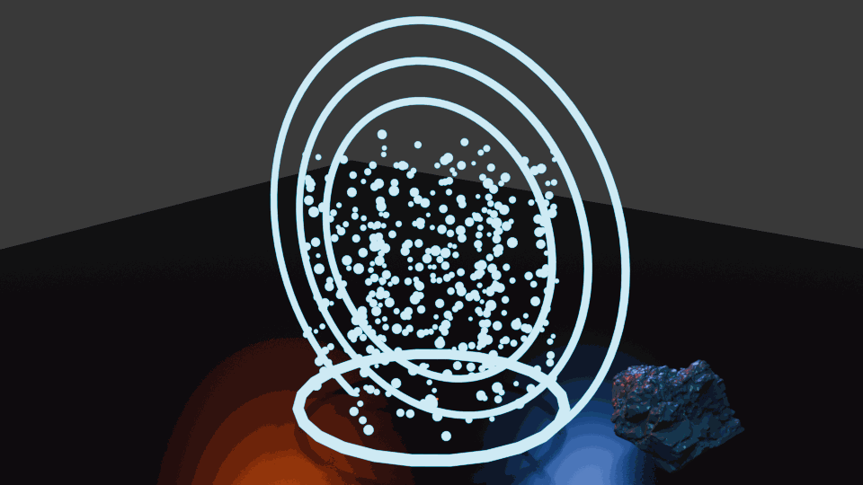

# dcc-mcp-blender

> Blender addon for the [DCC Model Context Protocol (MCP)](https://github.com/loonghao/dcc-mcp-core) ecosystem — embeds a Streamable HTTP MCP server directly inside Blender, letting any MCP-compatible AI client drive your 3D workflow.

[](https://badge.fury.io/py/dcc-mcp-blender)
[](https://pypi.org/project/dcc-mcp-blender/)
[](https://pypi.org/project/dcc-mcp-blender/#files)
[](https://github.com/dcc-mcp/dcc-mcp-blender/actions/workflows/ci.yml)
[](https://github.com/dcc-mcp/dcc-mcp-blender/actions/workflows/e2e.yml)
[](https://github.com/dcc-mcp/dcc-mcp-blender/actions/workflows/release.yml)
[](https://pypi.org/project/dcc-mcp-blender/)
[](https://github.com/dcc-mcp/dcc-mcp-blender/releases)
[](https://github.com/dcc-mcp/dcc-mcp-blender/releases)
[](https://github.com/dcc-mcp/dcc-mcp-blender/blob/main/pyproject.toml)
[](https://github.com/loonghao/dcc-mcp-core)
[](https://www.blender.org/download/releases/)
[](https://modelcontextprotocol.io/)
[](https://opensource.org/licenses/MIT)

---

## Six-DCC production showcase



This scene was produced through live DCC-MCP calls across six concurrently
registered instances: Maya authored an animated IK/FK skeleton, 3ds Max
imported and baked the character transforms, Houdini generated and cached the
procedural portal particles, and Blender assembled and rendered the final
scene. The environment includes the Poly Haven `boulder_01` asset downloaded
through the no-token `dcc-asset-polyhaven` marketplace skill (CC0-1.0).

The tested interchange chain used baked FBX for the rig, Alembic for animated effects.

---

## Overview

`dcc-mcp-blender` turns Blender into a first-class MCP server. Once the addon is enabled, any MCP client (Claude Desktop, custom agents, etc.) can call Blender tools over HTTP without any external gateway.

```
┌─────────────────────────────────┐
│  Blender (Python 3.10+)         │
├─────────────────────────────────┤
│  dcc_mcp_blender                │
│  ├─ BlenderMcpServer            │
│  ├─ SkillCatalog (200+ tools)   │
│  ├─ ActionRegistry              │
│  └─ HTTP Handlers               │
├─────────────────────────────────┤
│  dcc-mcp-core                   │
│  ├─ McpHttpServer               │
│  ├─ JSON-RPC 2.0                │
│  └─ SSE Streaming               │
└─────────────────────────────────┘
         ↓ http://127.0.0.1:8765/mcp
┌─────────────────────────────────┐
│  MCP Host (Claude / etc.)       │
└─────────────────────────────────┘
```

---

## Features

- **Embedded MCP server** — no external gateway needed; the server runs inside Blender's Python interpreter
- **200+ pre-built tools** — scene management, object manipulation, mesh/UV editing, rigging, pose libraries, interchange, materials, node graphs, rendering, physics, scripting, cross-DCC import and more
- **Extensible skill system** — drop new skill folders alongside built-ins or point to them via env vars
- **Main-thread host adapter** — GUI mode uses core `HostUiDispatcherBase` semantics through `BlenderUiDispatcher`; headless mode uses `BlenderHost` with a core `BlockingDispatcher`
- **Streamable HTTP transport** — compatible with any MCP 2025-03-26 client
- **Claude Desktop ready** — ship a one-line `mcpServers` config and you're done

---

## Available MCP Tools

| Category | Tools |
|---|---|
| **blender-scene** | `new_scene`, `open_scene`, `save_scene`, `list_objects`, `get_scene_info`, `get_session_info` |
| **blender-objects** | `create_object`, `delete_object`, `duplicate_object`, `move_object`, `rotate_object`, `scale_object`, `get_object_info`, `get_selection`, `set_selection`, `select_by_type`, `find_by_pattern`, `rename_object`, `parent_object`, `group_objects`, `set_visibility`, `get_bounding_box`, `center_origin`, `freeze_transforms` |
| **blender-mesh** | `add_modifier`, `apply_modifier`, `list_modifiers`, `get_mesh_info` |
| **blender-mesh-ops** | `get_poly_count`, `cleanup_mesh`, `triangulate_mesh`, `separate_mesh`, `combine_meshes`, `merge_vertices`, `extract_faces`, `mirror_mesh`, `select_by_material` |
| **blender-uv-ops** | `list_uv_maps`, `create_uv_map`, `delete_uv_map`, `copy_uv_map`, `get_uv_info`, `get_uv_islands`, `project_uvs`, `unwrap_uvs`, `pack_uvs`, `normalize_uvs` |
| **blender-rigging** | `create_armature`, `create_bone`, `mirror_bones`, `add_constraint`, `set_constraint_properties`, `bind_mesh_to_armature`, `add_shape_key`, `set_driver`, `retarget_animation` |
| **blender-pose-library** | `list_poses`, `save_pose`, `load_pose` |
| **blender-import-to-scene** | `import_to_scene` |
| **blender-interchange** | `import_file`, `import_fbx`, `import_obj`, `import_usd`, `export_gltf`, `export_usd`, `export_alembic`, `batch_export` |
| **blender-export-preset** | `list_export_presets`, `save_export_preset`, `load_export_preset`, `delete_export_preset` |
| **blender-shot-export** | `get_shot_info`, `export_camera` |
| **blender-validation** | `run_scene_checks`, `validate_mesh`, `validate_materials`, `validate_animation`, `validate_export_readiness`, `get_validation_report` |
| **blender-pipeline** | `get_asset_metadata`, `tag_asset_metadata`, `clear_asset_metadata`, `set_project_context`, `create_publish_manifest`, `prepare_publish_package` |
| **blender-materials** | `create_material`, `assign_material`, `set_material_color`, `list_materials`, `delete_material` |
| **blender-shader-nodes** | `list_material_nodes`, `set_principled_input`, `list_node_trees`, `list_nodes`, `create_node`, `delete_node`, `list_node_sockets`, `connect_nodes`, `disconnect_nodes`, `list_node_links`, `set_node_input`, `get_node_value`, `create_material_with_nodes`, `assign_texture_node`, `set_principled_inputs` |
| **blender-material-library** | `save_material_preset`, `list_material_presets`, `load_material_preset`, `delete_material_preset`, `get_shader_assignment`, `get_material_connections`, `set_material_attribute`, `assign_texture`, `list_images`, `reload_image`, `list_color_spaces`, `set_color_management` |
| **blender-texture-bake** | `list_bake_targets`, `bake_textures`, `bake_ambient_occlusion`, `bake_lighting`, `transfer_maps` |
| **blender-render** | `render_scene`, `set_render_settings`, `get_render_info`, `capture_viewport` |
| **blender-render-farm** | `validate_scene_for_farm`, `write_render_job`, `submit_render_job`, `get_render_job_status`, `list_render_jobs`, `cancel_render_job`, `cooperative_cancel`, `render_farm_status` |
| **blender-scripting** | `execute_python`, `execute_script_file`, `get_blender_info` |
| **blender-dev** | `attach_project`, `reload_modules`, `run_check`, `run_entrypoint`, `run_script`, `list_addons`, `get_addon_status`, `enable_addon`, `disable_addon`, `capture_ui_snapshot`, `find_ui_elements`, `start_debug_server`, `get_python_environment` |
| **blender-animation** | `set_keyframe`, `set_frame_range`, `get_frame_range`, `set_current_frame`, `get_keyframes`, `delete_keyframes`, `bake_animation` |
| **blender-lighting** | `create_light`, `set_light_properties`, `list_lights`, `set_world_background` |
| **blender-light-rig** | `create_three_point_light_rig`, `create_area_softbox`, `create_hdri_world`, `list_light_rigs`, `set_light_rig_intensity`, `aim_light_at_object`, `group_lights`, `set_render_view_transform`, `get_lighting_summary` |
| **blender-camera** | `create_camera`, `set_active_camera`, `set_camera_properties`, `list_cameras` |
| **blender-collection** | `create_collection`, `link_to_collection`, `list_collections` |
| **blender-geometry** | `create_sphere`, `save_blend`, `file_exists`, `export_fbx`, `export_obj` |
| **blender-geometry-nodes** | `add_geometry_nodes_modifier`, `list_geometry_nodes_modifiers`, `create_geometry_node_group`, `assign_geometry_node_group`, `set_geometry_node_modifier_input`, `evaluate_geometry_nodes_info` |
| **blender-physics** | `add_rigid_body`, `set_rigid_body_properties`, `remove_rigid_body`, `list_rigid_bodies`, `set_rigid_body_world_settings`, `bake_rigid_body_simulation`, `clear_rigid_body_bake`, `add_cloth_modifier`, `set_cloth_settings`, `add_collision_modifier`, `set_collision_settings`, `list_simulation_modifiers`, `bake_simulation`, `clear_simulation_cache`, `get_simulation_status` |

See [`src/dcc_mcp_blender/skills/SKILLS_INDEX.md`](src/dcc_mcp_blender/skills/SKILLS_INDEX.md) for staged loading guidance, task-to-skill chains, and side-effect profiles for all bundled skills.

---

## Installation

### Agent install (recommended)

Want an AI agent to install the Blender-side dependencies, write the MCP host
config, and walk you through enabling the add-on? Just ask your agent:

```text
帮我参考 dcc-mcp/dcc-mcp-blender/install.md 去安装
```

The agent follows [`install.md`](install.md), which delegates the setup workflow
to [`skills/dcc-mcp-blender-setup`](skills/dcc-mcp-blender-setup). The remaining
options below are for manual installation.

### Option 1 — Install as Blender Extension (ZIP, recommended)

> **Important:** The release ZIP uses the **Blender 4.2+ Extension** format with
> `blender_manifest.toml` at the archive root and a flat package layout.
> **Legacy add-on install** (`Edit → Preferences → Add-ons → Install`) will
> fail with *"ZIP packaged incorrectly; `__init__.py` should be in a
> directory, not at top-level"*. This is expected — use the Extensions path
> below. The Extension format is the **only supported GUI installation path**.

1. Download the latest platform ZIP from the [Releases](https://github.com/dcc-mcp/dcc-mcp-blender/releases) page:
   `dcc_mcp_blender_addon_win64_vX.Y.Z.zip`, `dcc_mcp_blender_addon_linux_vX.Y.Z.zip`, or
   `dcc_mcp_blender_addon_macos_vX.Y.Z.zip`
2. In Blender 4.2+: **Edit → Preferences → Extensions → Install from Disk…** → select the ZIP.
   (Do **NOT** use **Edit → Preferences → Add-ons → Install** — that legacy path is unsupported.)
3. Enable **DCC MCP Blender**
4. The MCP server starts automatically on `http://127.0.0.1:8765`

Release ZIPs are Blender 4.2+ Extension packages. They include `blender_manifest.toml` and the matching `dcc-mcp-core` wheel under `wheels/`, so Blender installs the Python dependency into the extension's isolated environment.

The extension ZIP is assembled by `packaging/assemble_zip.py`. It resolves the latest compatible `dcc-mcp-core` wheel, places it under `wheels/`, and injects that wheel into `blender_manifest.toml`; Blender 4.2+ then installs it through the extension wheel mechanism instead of relying on global `pip` packages or `sys.path` edits. See [`packaging/release_smoke_checklist.md`](packaging/release_smoke_checklist.md) for the manual smoke test procedure.

### Option 2 — Install via pip (for scripts / CI)

```bash
pip install dcc-mcp-blender
```

Then in Blender's Python console:

```python
import dcc_mcp_blender
dcc_mcp_blender.start_server()
```

### Headless Bootstrap

For CI or automation that needs Blender's main thread dispatcher:

```bash
blender --background --python src/dcc_mcp_blender/blender_bootstrap.py
```

The bootstrap prints `MCP_URL=...`, discovers bundled skills, and drives `BlenderHost` in headless mode until the process is stopped.

In interactive add-on mode, `BlenderUiDispatcher` subclasses the shared core UI dispatcher and `BlenderTimerPump`
contains the Blender-specific `bpy.app.timers` wiring. In background mode, `BlenderHost` keeps using core
`BlockingDispatcher` with an explicit headless loop so automation does not depend on Blender UI timers.

---

## Quick Start

### Claude Desktop

Add to your `claude_desktop_config.json`:

```json
{
  "mcpServers": {
    "blender": {
      "url": "http://127.0.0.1:8765/mcp"
    }
  }
}
```

Make sure the Blender addon is enabled and the server is running, then restart Claude Desktop.

### Python API

```python
import dcc_mcp_blender

# Start the server (default port 8765)
dcc_mcp_blender.start_server()

# Stop the server
dcc_mcp_blender.stop_server()
```

---

## Configuration

### Environment Variables

| Variable | Default | Description |
|----------|---------|-------------|
| `DCC_MCP_BLENDER_SEMANTIC_INDEX` | `0` (off) | Set to `1` to enable the opt-in lexical+vector hybrid skill recall. When enabled, `search_skills` fuses BM25 with vector similarity via Reciprocal Rank Fusion (RRF), improving recall for natural-language queries like "import USD files" or "rendering a preview". |
| `DCC_MCP_BLENDER_SEMANTIC_EMBEDDER` | `hashed` | Embedder backend for semantic recall. `hashed` (default) uses a zero-dependency hash-based embedding. Set to `onnx` for dense embeddings via `OnnxEmbedder` (requires `pip install 'dcc-mcp-core[semantic]'`). |
| `DCC_MCP_BLENDER_READINESS_TIMEOUT_SECS` | *(none)* | Optional timeout in seconds for the readiness probe's dcc verification step. |
| `DCC_MCP_BLENDER_METRICS` | `false` | Enable Prometheus `/metrics` HTTP endpoint. |
| `DCC_MCP_BLENDER_JOB_STORAGE` | *(auto)* | Directory for render-job SQLite persistence; auto-resolves to platform tempdir when unset. |
| `DCC_MCP_BLENDER_STRICT_SKILL_SCAN` | `false` | Raise on invalid skill YAML instead of logging a debug warning and skipping. |
| `DCC_MCP_BLENDER_ENABLE_WORKFLOWS` | `true` | Enable workflow orchestration surface (`workflows.run`, `workflows.resume`, etc.). |
| `DCC_MCP_BLENDER_ENABLE_GATEWAY_FAILOVER` | `true` | Enable gateway failover for high-availability configurations. |
| `DCC_MCP_BLENDER_DISABLE_EXECUTE_PYTHON` | `false` | Disable the `execute_python` tool to restrict arbitrary code execution. |
| `DCC_MCP_BLENDER_DISABLE_ARBITRARY_SCRIPT` | `false` | Disable arbitrary script execution; implies `DCC_MCP_BLENDER_DISABLE_EXECUTE_PYTHON`. |
| `DCC_MCP_BLENDER_PROJECT_TOOLS` | *(none)* | Set to `0` to opt out of the four `project_*` MCP tools. |
| `DCC_MCP_BLENDER_RESOURCES` | *(none)* | Set to `0` to opt out of MCP resource publishing (e.g. `scene://current`). |
| `DCC_MCP_BLENDER_SKILL_PATHS` | *(none)* | Additional `os.pathsep`-delimited skill search paths extending the bundled set. |
| `DCC_MCP_SKILL_PATHS` | *(none)* | Shared across all DCC-MCP packages; skill-path search falls back here when the Blender-specific var is unset. |

#### Enabling Semantic Skill Recall

```bash
# Enable hybrid BM25 + vector recall
export DCC_MCP_BLENDER_SEMANTIC_INDEX=1

# Optional: use ONNX for dense embeddings (better semantic matching)
pip install 'dcc-mcp-core[semantic]'
export DCC_MCP_BLENDER_SEMANTIC_EMBEDDER=onnx
```

When enabled, skill search results include a `[semantic]` extra field and RRF-fused scores.
The feature is **opt-in** — BM25-only recall remains the default and is not affected when the
env var is unset.

---

## Development

```bash
git clone https://github.com/dcc-mcp/dcc-mcp-blender
cd dcc-mcp-blender
pip install -e ".[dev]"
pytest
```

---

## License

MIT — see [LICENSE](LICENSE) for details.
